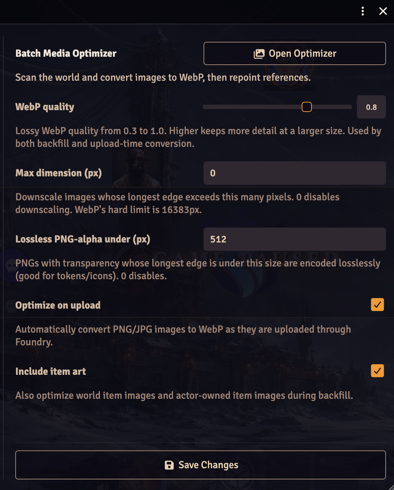
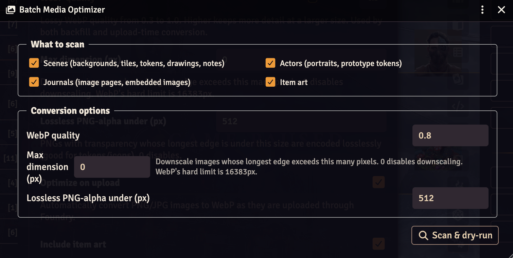
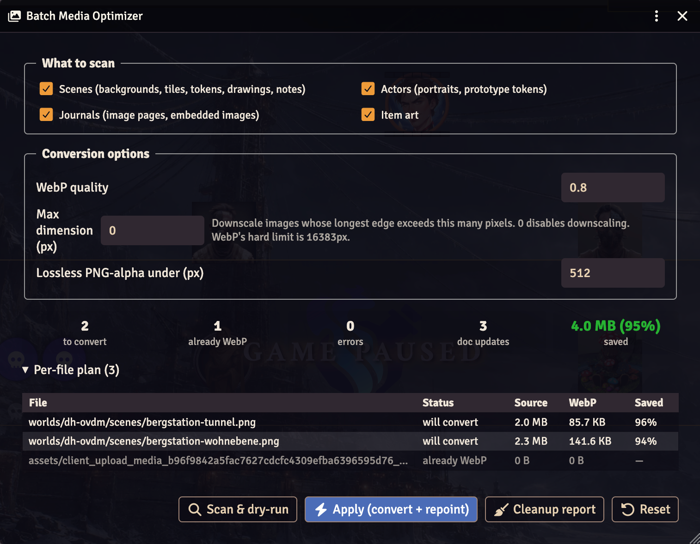

# Batch Media Optimizer

A Foundry VTT module that optimizes world media — scene backgrounds, token/actor
art, journal images, video maps, playlist audio — by converting images to
**WebP**, video to **WebM (VP9)**, and audio to **Ogg/Opus** (with optional
downscaling) and repointing the document references. It works two ways:

1. **Backfill** — retroactively optimize media already present in a world
   (images, video, *and* audio).
2. **Upload-time** — auto-convert images as they are uploaded, so the world
   stays optimized going forward. (Video/audio are backfill-only — see Usage.)

It never touches the database on disk. Every write goes through Foundry's own
API (`FilePicker.upload`, `Document#update`), so it is safe on v13/v14 LevelDB
and beyond.

> Compatibility: Foundry VTT **v13–v14** (minimum 13, verified 14.364). GM-only.

## Screenshots

| Settings | Scope picker | Dry-run report |
|---|---|---|
|  |  |  |

## Install

**In-app (recommended).** In Foundry's setup screen go to **Add-on Modules →
Install Module**, search for *Batch Media Optimizer*, and click **Install**.

**Manifest URL.** If it isn't listed yet, paste this into the **Manifest URL**
field at the bottom of the Install Module dialog:

```
https://github.com/aronjanosch/foundryvtt-batch-media-optimizer/releases/latest/download/module.json
```

Either way, enable it per-world in **Manage Modules**. No build step — it ships
as plain ESM.

## Usage

### Backfill an existing world

1. **Game Settings → Configure Settings → Batch Media Optimizer → Open
   Optimizer**, or run a macro:
   ```js
   game.modules.get("batch-media-optimizer").api.open();
   ```
2. Choose what to scan (scenes / actors / journals / item art / video) and the
   conversion options.
3. **Scan & dry-run** — shows a per-file plan with byte savings. Images/audio
   are converted in memory for exact numbers; video is *estimated* from its
   metadata (marked "est.") so the dry-run stays fast. Nothing is written.
4. Review, untick any files you want to skip, then **Apply** — uploads
   `.webp`/`.webm`/`.ogg` twins next to the originals and repoints every
   document field. Confirm the backup prompt first.
5. **Cleanup report** lists originals that now have a twin and are no longer
   referenced, so you can delete them manually (Foundry has no file-delete API).

### Video (MP4/MOV → WebM)

Tick **Video** in the scan scope to also convert video maps, video tiles, and
animated tokens to WebM (VP9). Conversion runs entirely in the browser via
**WebCodecs** (hardware-accelerated where available) — no server-side ffmpeg.
Notes:

- **Backfill only.** Video isn't converted on upload: encoding takes seconds to
  minutes per clip, far too long to block an upload on.
- **Audio is dropped.** Foundry's video maps/tiles are silent loops, so the
  output is video-only WebM. (This keeps the pipeline small and fast.)
- **Slow but cancellable.** The dry-run only *estimates* video size (from
  bitrate × duration) so it stays fast; the real encode happens on Apply, where
  the progress bar shows per-clip frame progress and Cancel stops cleanly.
- **Codec support is the browser's.** Sources the browser can't decode (e.g.
  HEVC on some platforms) are reported as per-file errors and skipped.

### Audio (MP3/WAV/FLAC/… → Ogg/Opus)

Tick **Audio** in the media types to convert playlist sounds and scene ambient
sounds to **Ogg/Opus** — the most efficient audio codec, in Foundry's native
audio container. Decoding uses the browser's `decodeAudioData` (any format it
supports) and encoding uses WebCodecs `AudioEncoder`. Notes:

- **Backfill only**, same reasoning as video.
- **Ogg/Opus plays in Foundry's client and Chrome/Firefox/Edge — but not
  Safari.** This matches what other Foundry audio tooling uses; if your players
  use Safari, leave audio off.
- Already-`.ogg`/`.opus` files are skipped (already optimal).

### Auto-optimize on upload

Enable **Optimize on upload** in settings. PNG/JPG images uploaded through
Foundry are then converted to WebP before they hit disk, using the same
quality/downscale settings. WebP/SVG/audio/video and anything that wouldn't
shrink pass through untouched (video is handled by backfill instead).

## Settings

| Setting | Default | Effect |
|---|---|---|
| WebP quality | `0.8` | Lossy image quality (0.3–1.0), shared by both modes. |
| Max dimension (px) | `0` | Downscale longest edge above this (images + video); `0` disables. |
| Lossless PNG-alpha under (px) | `512` | Small transparent PNGs (tokens/icons) stay lossless. |
| Video quality | `0.8` | VP9 quality (0.3–1.0) → bits-per-pixel bitrate target, backfill only. |
| Audio quality | `0.8` | Opus quality (0.3–1.0) → bitrate target, backfill only. |
| Optimize on upload | off | Auto-convert uploaded images to WebP. |
| Include item art | on | Also scan world + actor-owned item images during backfill. |
| Include video | on | Also convert MP4/MOV video to WebM during backfill. |
| Include audio | on | Also convert playlist + ambient audio to Ogg/Opus during backfill. |

## Safety

- **Dry-run by default.** The Apply button is the only thing that writes.
- **Originals are kept.** Conversion writes a sibling `.webp`/`.webm`; nothing is
  deleted.
- **Idempotent.** Files whose optimized twin already exists are skipped but still
  repointed, so an interrupted run can be re-applied to finish.
- **Never grows a file.** If the converted twin is larger than the original
  (common for already-efficient video), it's discarded and the ref left alone.
- **Take a fresh world backup before the first live run.**

## Architecture

Pure client-side, runs inside an authenticated GM session.

| File | Responsibility |
|---|---|
| `scripts/converter.mjs` | `OffscreenCanvas` → WebP, downscale, lossless-alpha heuristic, 16383px guard. |
| `scripts/video-converter.mjs` | WebCodecs MP4/MOV → WebM/VP9: mp4box demux → `VideoDecoder` → downscale → `VideoEncoder` → webm-muxer. |
| `scripts/audio-converter.mjs` | `decodeAudioData` → WebCodecs `AudioEncoder` (Opus) → Ogg mux. |
| `scripts/ogg.mjs` | Self-contained Ogg/Opus muxer (page framing, CRC, OpusHead/OpusTags). |
| `scripts/discovery.mjs` | Walk documents, collect image + video + audio field references (incl. wildcards + embedded HTML). |
| `scripts/paths.mjs` | Editable-path filter, media-kind classification, `.webp`/`.webm`/`.ogg` twin naming, cached directory browser. |
| `scripts/optimizer.mjs` | Plan → convert (dispatch image/video) → upload → repoint; dry-run, idempotency, cleanup report. |
| `scripts/upload-hook.mjs` | Wraps `FilePicker.upload` for upload-time image conversion. |
| `scripts/apps/optimizer-app.mjs` | ApplicationV2 backfill UI: scope picker, dry-run report, progress + cancel. |
| `scripts/settings.mjs` | Shared converter settings + menu registration. |
| `scripts/vendor/` | Vendored ESM deps for video: `mp4box.mjs` (demux) and `webm-muxer.mjs` (mux). |

## Limitations

- **Video and audio are backfill-only** — see those sections. They need a
  browser with WebCodecs (VP9 encode for video, Opus encode for audio) — current
  Chromium/Electron; Foundry's bundled client qualifies.
- **Ogg/Opus audio does not play in Safari.** Leave audio off if your players
  use Safari. (Video's WebM/VP9 has the same caveat.)
- Video's own audio track is dropped (scene/tile clips are silent loops).
- Only operates on world / user data; module- and system-shipped assets are left
  alone (they get overwritten on update).
- No automatic deletion of originals — Foundry exposes no file-delete API.

## License

MIT — see [LICENSE](LICENSE).
